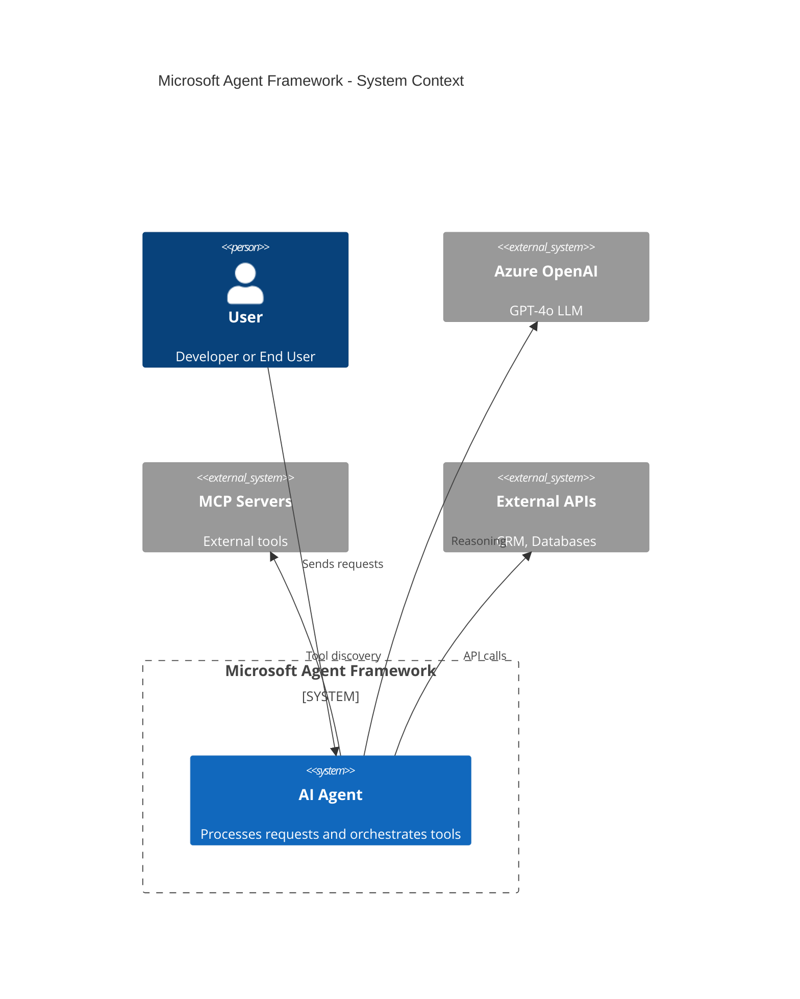
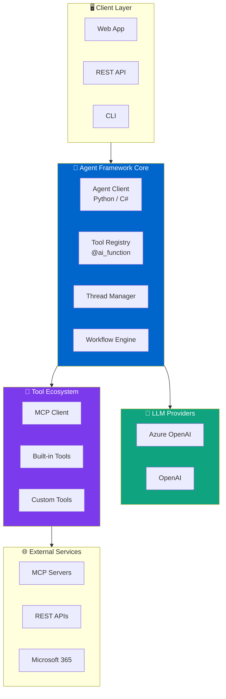
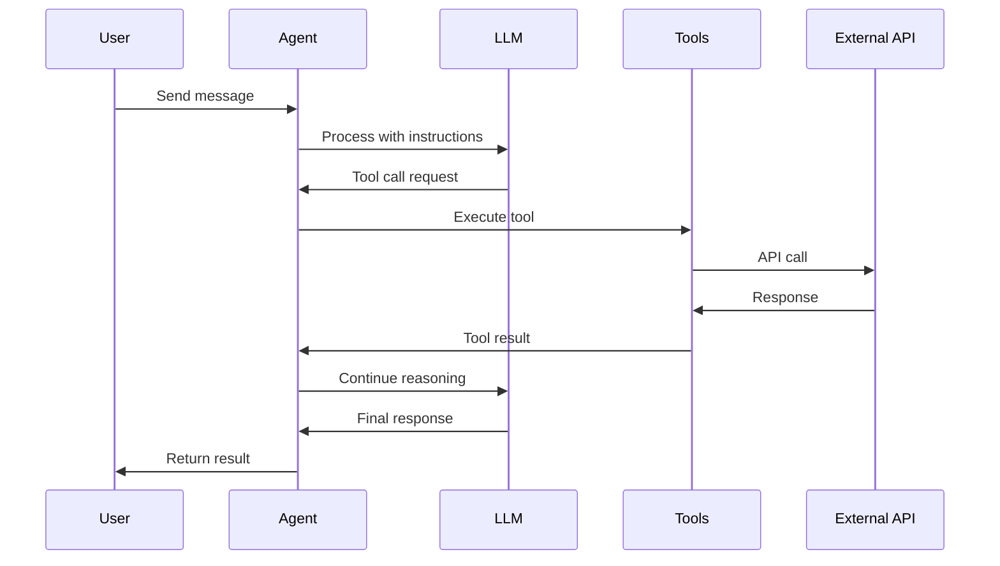
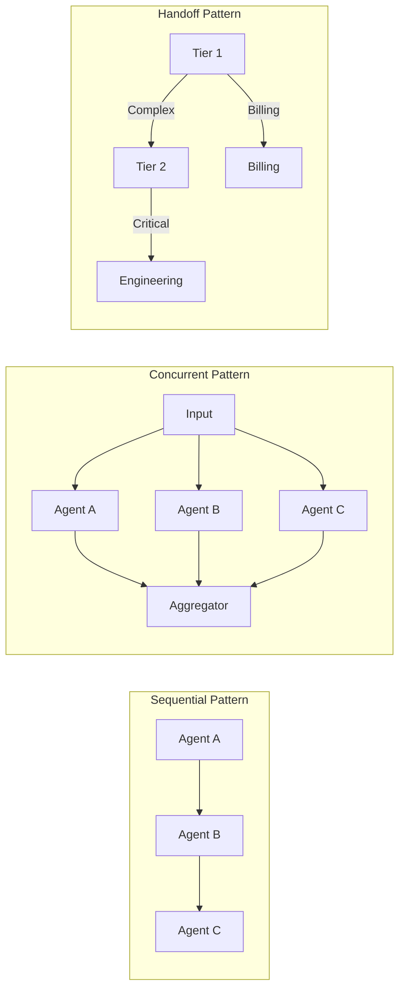

# Microsoft Agent Framework Series - Code Examples

[](LICENSE)
[](https://dotnet.microsoft.com/)
[](https://python.org/)

Complete source code examples for the **Microsoft Agent Framework (MAF) Series** published on [dataa.dev](https://www.dataa.dev).

## 📚 Article Series

| Part | Title | Code Folder | Article |
|------|-------|-------------|---------|
| 1 | Introduction to Microsoft Agent Framework | [part-01-introduction](./part-01-introduction/) | [Read →](https://www.dataa.dev/2025/10/01/introduction-to-microsoft-agent-framework-the-open-source-engine-for-agentic-ai-apps-part-1/) |
| 2 | Building Your First AI Agent (.NET) | [part-02-dotnet-agent](./part-02-dotnet-agent/) | [Read →](https://www.dataa.dev/2025/10/08/building-your-first-ai-agent-with-microsoft-agent-framework-net-part-2/) |
| 3 | Building Your First AI Agent (Python) | [part-03-python-agent](./part-03-python-agent/) | [Read →](https://www.dataa.dev/2025/10/15/building-your-first-ai-agent-with-microsoft-agent-framework-python-part-3/) |
| 4 | Tools & Function Calling Deep Dive | [part-04-tools-function-calling](./part-04-tools-function-calling/) | [Read →](https://www.dataa.dev/2025/10/22/tools-function-calling-in-microsoft-agent-framework-part-4/) |
| 5 | Multi-Turn Conversations & Agent Threads | [part-05-multi-turn-conversations](./part-05-multi-turn-conversations/) | [Read →](https://www.dataa.dev/2025/10/29/multi-turn-conversations-agent-threads-in-microsoft-agent-framework-part-5/) |
| 6 | Workflows: Graph-Based Orchestration | [part-06-workflows](./part-06-workflows/) | [Read →](https://www.dataa.dev/2025/11/05/workflows-graph-based-agent-orchestration-in-microsoft-agent-framework-part-6/) |
| 7 | Multi-Agent Orchestration Patterns | [part-07-multi-agent-patterns](./part-07-multi-agent-patterns/) | [Read →](https://www.dataa.dev/2025/11/12/multi-agent-orchestration-patterns-in-microsoft-agent-framework-part-7/) |
| 8 | Production-Ready Agents | [part-08-production-ready](./part-08-production-ready/) | [Read →](https://www.dataa.dev/2025/11/19/production-ready-agents-observability-security-deployment-part-8/) |
| 9 | MCP Integration & External Tools | [part-09-mcp-integration](./part-09-mcp-integration/) | [Read →](https://www.dataa.dev/2025/11/26/mcp-integration-external-tool-connectivity-in-microsoft-agent-framework-part-9/) |
| 10 | Migration Guide (SK & AutoGen) | [part-10-migration-guide](./part-10-migration-guide/) | [Read →](https://www.dataa.dev/2025/11/30/migration-guide-from-semantic-kernel-autogen-to-microsoft-agent-framework-part-10/) |

## 🚀 Quick Start

### Prerequisites

- **Python 3.11+** with pip
- **.NET 8.0 SDK** for C# examples
- **Azure OpenAI** or OpenAI API access
- **Azure CLI** (for authentication)

### Environment Setup

```bash
# Clone the repository
git clone https://github.com/nithinmohantk/microsoft-agent-framework-series-examples.git
cd microsoft-agent-framework-series-examples

# Create Python virtual environment
python -m venv .venv
source .venv/bin/activate  # Linux/macOS
# .venv\Scripts\activate   # Windows

# Install Python dependencies
pip install -r requirements.txt

# Restore .NET dependencies
dotnet restore
```

### Configuration

Create a `.env` file in the root directory:

```env
# Azure OpenAI Configuration
AZURE_OPENAI_ENDPOINT=https://your-resource.openai.azure.com
AZURE_OPENAI_DEPLOYMENT_NAME=gpt-4o
AZURE_OPENAI_API_VERSION=2024-08-01-preview

# Optional: For MCP examples
MCP_TOKEN=your-mcp-token

# Optional: For M365 integration
AZURE_TENANT_ID=your-tenant-id
AZURE_CLIENT_ID=your-client-id
```

### Authentication

The examples use Azure CLI authentication by default:

```bash
az login
```

## 🏗️ Architecture

### System Context Diagram (C4 Model)



### Component Architecture



### Agent Execution Flow



### Multi-Agent Orchestration Patterns



## 📁 Repository Structure

```
microsoft-agent-framework-series-examples/
├── part-01-introduction/
│   └── README.md                    # Conceptual overview
├── part-02-dotnet-agent/
│   ├── CustomerSupportAgent/        # .NET 8 project
│   │   ├── Program.cs
│   │   ├── Tools/
│   │   └── CustomerSupportAgent.csproj
│   └── README.md
├── part-03-python-agent/
│   ├── research_assistant.py        # Complete Python agent
│   ├── requirements.txt
│   └── README.md
├── part-04-tools-function-calling/
│   ├── python/                      # Python tool examples
│   │   ├── basic_tools.py
│   │   ├── async_tools.py
│   │   └── crm_integration.py
│   ├── dotnet/                      # .NET tool examples
│   │   └── AdvancedTools.cs
│   └── README.md
├── part-05-multi-turn-conversations/
│   ├── python/
│   │   ├── multi_turn_demo.py
│   │   ├── redis_persistence.py
│   │   └── human_in_loop.py
│   ├── dotnet/
│   │   └── MultiTurnAgent.cs
│   └── README.md
├── part-06-workflows/
│   ├── python/
│   │   ├── document_workflow.py
│   │   ├── conditional_routing.py
│   │   └── checkpointing.py
│   ├── dotnet/
│   │   └── ApprovalWorkflow.cs
│   └── README.md
├── part-07-multi-agent-patterns/
│   ├── sequential_orchestrator.py
│   ├── concurrent_orchestrator.py
│   ├── handoff_orchestrator.py
│   ├── group_chat_orchestrator.py
│   ├── magentic_orchestrator.py
│   ├── a2a_communication.py
│   └── README.md
├── part-08-production-ready/
│   ├── python/
│   │   ├── telemetry_config.py
│   │   ├── security_auth.py
│   │   ├── content_safety.py
│   │   ├── resilient_agent.py
│   │   └── azure_foundry_deploy.py
│   ├── docker/
│   │   ├── Dockerfile
│   │   ├── docker-compose.yml
│   │   └── otel-collector-config.yaml
│   └── README.md
├── part-09-mcp-integration/
│   ├── mcp_client_demo.py
│   ├── multi_mcp_servers.py
│   ├── custom_mcp_server.py
│   ├── m365_integration.py
│   └── README.md
├── part-10-migration-guide/
│   ├── semantic_kernel/
│   │   ├── before_sk_agent.py
│   │   └── before_sk_plugins.py
│   ├── autogen/
│   │   ├── before_autogen_agent.py
│   │   └── before_autogen_teams.py
│   ├── agent_framework/
│   │   ├── after_af_agent.py
│   │   ├── after_af_tools.py
│   │   └── after_af_workflows.py
│   └── README.md
├── shared/
│   └── utils.py                     # Common utilities
├── requirements.txt                 # Python dependencies
├── global.json                      # .NET SDK version
├── MAF.sln                          # .NET solution file
├── LICENSE
└── README.md
```

## 🔧 Running Examples

### Python Examples

```bash
# Part 3: Research Assistant
cd part-03-python-agent
python research_assistant.py

# Part 7: Sequential Orchestrator
cd part-07-multi-agent-patterns
python sequential_orchestrator.py
```

### .NET Examples

```bash
# Part 2: Customer Support Agent
cd part-02-dotnet-agent/CustomerSupportAgent
dotnet run

# Part 6: Approval Workflow
cd part-06-workflows/dotnet
dotnet run
```

### Docker Deployment

```bash
cd part-08-production-ready/docker
docker-compose up -d
```

## 📖 Author

**Nithin Mohan T K**  
Enterprise Solution Architect | Azure | AI/ML | .NET | Python

- Blog: [dataa.dev](https://www.dataa.dev)
- GitHub: [@nithinmohantk](https://github.com/nithinmohantk)
- LinkedIn: [nithinmohantk](https://linkedin.com/in/nithinmohantk)

## 📄 License

This project is licensed under the MIT License - see the [LICENSE](LICENSE) file for details.

## 🔗 References

- [Microsoft Agent Framework GitHub](https://github.com/microsoft/agent-framework)
- [MAF Documentation](https://learn.microsoft.com/en-us/agent-framework/)
- [Model Context Protocol](https://modelcontextprotocol.io/)
- [Azure AI Foundry](https://learn.microsoft.com/en-us/azure/ai-studio/)
