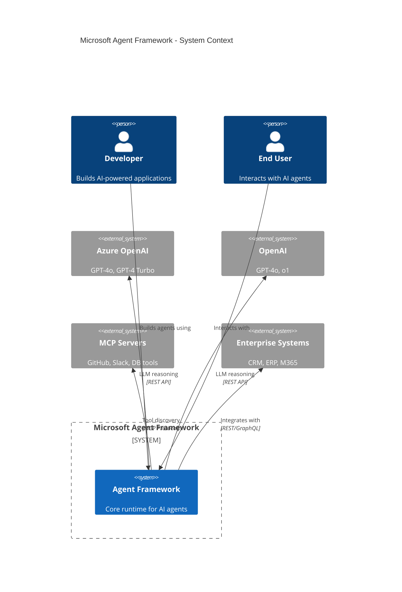
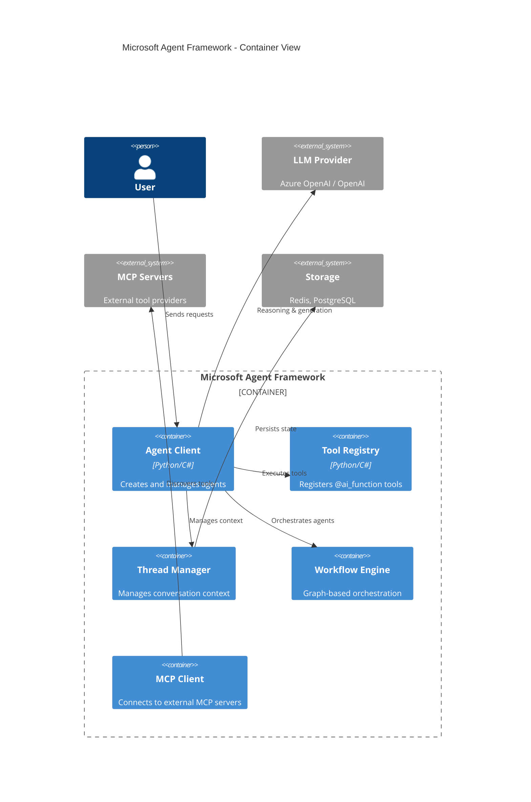
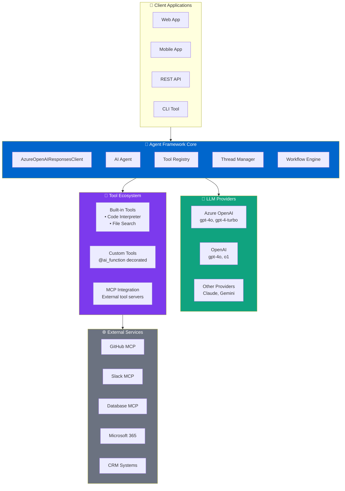
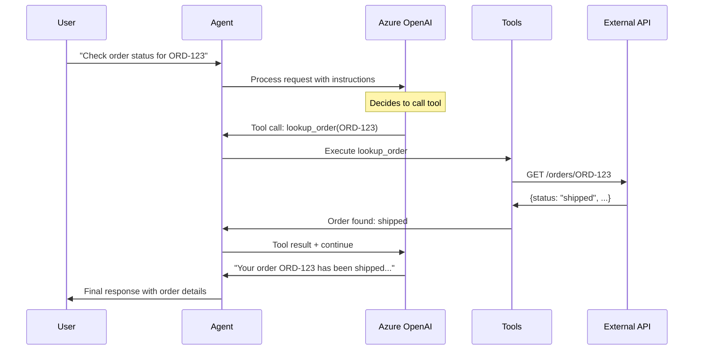

# Part 1: Introduction to Microsoft Agent Framework

This folder contains conceptual documentation and diagrams for understanding the Microsoft Agent Framework architecture.

## 🎯 What is Microsoft Agent Framework?

Microsoft Agent Framework (MAF) is an **open-source, model-agnostic framework** for building AI agents that can:
- **Reason** about user requests using LLMs
- **Use tools** to take real-world actions
- **Maintain context** across multi-turn conversations
- **Orchestrate** multiple agents for complex workflows

## 🏗️ Architecture Overview

### System Context (C4 Level 1)

### Container Diagram (C4 Level 2)

### Component Architecture

### Agent Execution Flow

## 🔑 Core Concepts

| Concept | Description | Example |
|---------|-------------|---------|
| **Agent** | AI entity that processes requests | `client.create_agent(name, instructions, tools)` |
| **Tools** | Functions the agent can call | `@ai_function` decorated functions |
| **Thread** | Conversation context | `agent.get_new_thread()` |
| **Workflow** | Multi-agent orchestration | `WorkflowBuilder` with edges |
| **MCP** | External tool protocol | Connect to GitHub, Slack, DB servers |

## 🆚 Comparison with Other Frameworks

| Feature | MAF | Semantic Kernel | AutoGen | LangChain |
|---------|-----|-----------------|---------|-----------|
| **Model Agnostic** | ✅ | ✅ | ✅ | ✅ |
| **Native .NET** | ✅ | ✅ | ❌ | ❌ |
| **Native Python** | ✅ | ✅ | ✅ | ✅ |
| **MCP Support** | ✅ | ❌ | ❌ | ❌ |
| **Azure Integration** | ✅ | ✅ | ⚠️ | ⚠️ |
| **Multi-Agent** | ✅ | ⚠️ | ✅ | ⚠️ |
| **Azure AI Foundry** | ✅ | ❌ | ❌ | ❌ |

## 📖 Article Link

📖 [Read the full article →](https://www.dataa.dev/2025/10/01/introduction-to-microsoft-agent-framework-the-open-source-engine-for-agentic-ai-apps-part-1/)

## ➡️ Next Steps

Continue to [Part 2: Building Your First Agent (.NET)](../part-02-dotnet-agent/)
