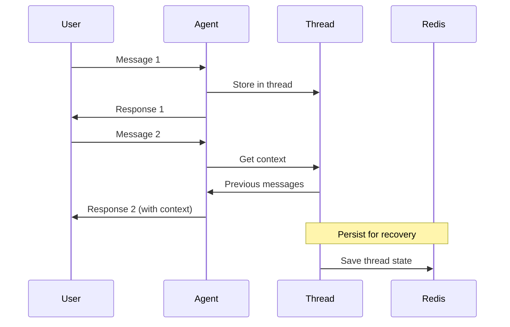

# Part 5: Multi-Turn Conversations & Agent Threads

Examples for managing conversation context, persistence, and human-in-the-loop workflows.

## 🏗️ Thread Architecture

## 📁 Files

### Python
| File | Description |
|------|-------------|
| `python/multi_turn_demo.py` | Basic multi-turn conversation |
| `python/redis_persistence.py` | Thread persistence with Redis |
| `python/human_in_loop.py` | Human approval workflow |

### .NET / C#
| File | Description |
|------|-------------|
| `dotnet/MultiTurnDemo.cs` | Multi-turn conversation demo |
| `dotnet/RedisThreadStore.cs` | Redis persistence class |

## 🔑 Key Concepts

| Concept | Python | C# |
|---------|--------|-----|
| Create Thread | `agent.get_new_thread()` | `agent.GetNewThread()` |
| Run with Thread | `agent.run(msg, thread)` | `agent.RunAsync(msg, thread)` |
| Save Thread | `store.save_thread(id, thread)` | `store.SaveThreadAsync(id, thread)` |

## 📖 Article Link

📖 [Read the full article →](https://www.dataa.dev/2025/10/29/multi-turn-conversations-agent-threads-in-microsoft-agent-framework-part-5/)
