# Part 6: Workflows - Graph-Based Orchestration

Examples of workflow patterns for orchestrating multiple agents.

## 🏗️ Workflow Architecture

### Workflow Execution Model

```mermaid
flowchart TB
    subgraph Input["📥 Input"]
        I[User Request]
    end
    
    subgraph Workflow["🔄 Workflow Engine"]
        direction TB
        WB[WorkflowBuilder]
        WE[Workflow Executor]
        CP[Checkpoint Store]
    end
    
    subgraph Agents["🤖 Agent Pool"]
        A1[Classifier Agent]
        A2[Processor Agent]
        A3[Validator Agent]
    end
    
    subgraph Output["📤 Output"]
        O[Final Result]
    end
    
    I --> WB
    WB --> WE
    WE --> A1 --> A2 --> A3
    WE -.-> CP
    A3 --> O
    
    style Workflow fill:#7c3aed,color:#fff
```

### Conditional Routing

## 📁 Files

### Python
| File | Description |
|------|-------------|
| `python/document_workflow.py` | Document processing pipeline |
| `python/conditional_routing.py` | Conditional routing by document type |

### .NET / C#
| File | Description |
|------|-------------|
| `dotnet/DocumentWorkflow.cs` | Document processing workflow |
| `dotnet/ApprovalWorkflow.cs` | Approval workflow with conditional routing |

## 🔑 Key Concepts

| Concept | Python | C# |
|---------|--------|-----|
| Create Builder | `WorkflowBuilder()` | `new WorkflowBuilder()` |
| Add Agent | `builder.add_executor(agent)` | `builder.AddExecutor(agent)` |
| Add Edge | `builder.add_edge(a, b)` | `builder.AddEdge(a, b)` |
| Conditional Edge | `builder.add_conditional_edge(...)` | `builder.AddConditionalEdge(...)` |
| Run Workflow | `await workflow.run(input)` | `await workflow.RunAsync(input)` |

## 📖 Article Link

📖 [Read the full article →](https://www.dataa.dev/2025/11/05/workflows-graph-based-agent-orchestration-in-microsoft-agent-framework-part-6/)
