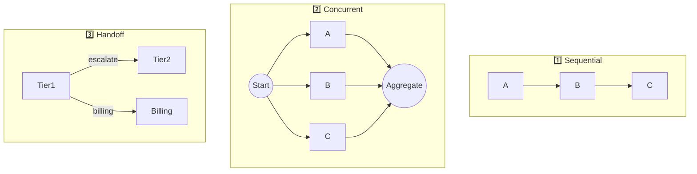
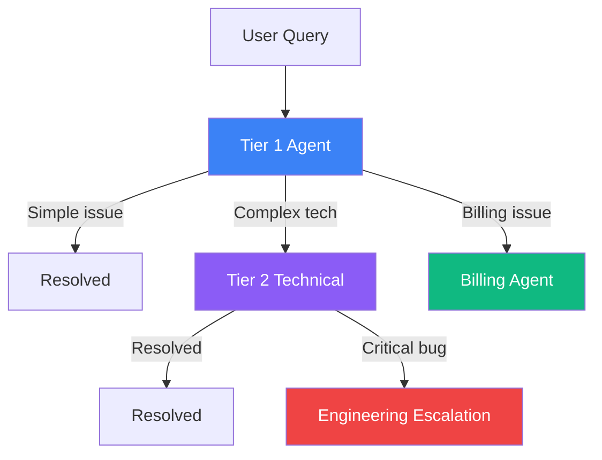

# Part 7: Multi-Agent Orchestration Patterns

Examples of different orchestration patterns for multi-agent systems.

## 🏗️ Orchestration Patterns

### Pattern Overview

### Handoff Pattern (Tiered Support)

## 📁 Files

### Python
| File | Description |
|------|-------------|
| `sequential_orchestrator.py` | Research → Write → Edit pipeline |
| `concurrent_orchestrator.py` | Parallel analysis team |
| `handoff_orchestrator.py` | Tiered support with escalation |

### .NET / C#
| File | Description |
|------|-------------|
| `dotnet/SequentialOrchestration.cs` | Sequential pipeline pattern |
| `dotnet/ConcurrentOrchestration.cs` | Parallel execution with aggregation |
| `dotnet/HandoffOrchestration.cs` | Tiered support with handoffs |

## 🔑 Pattern Comparison

| Pattern | Use Case | Python | C# |
|---------|----------|--------|-----|
| Sequential | Linear pipelines | `SequentialOrchestrator` | `SequentialOrchestrator` |
| Concurrent | Parallel analysis | `ConcurrentOrchestrator` | `ConcurrentOrchestrator` |
| Handoff | Tiered support | `HandoffOrchestrator` | `HandoffOrchestrator` |

## 📖 Article Link

📖 [Read the full article →](https://www.dataa.dev/2025/11/12/multi-agent-orchestration-patterns-in-microsoft-agent-framework-part-7/)
