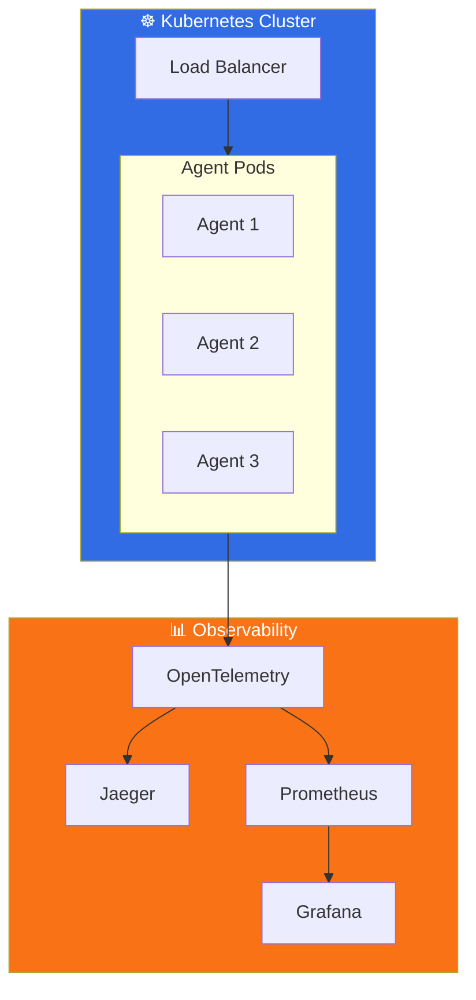
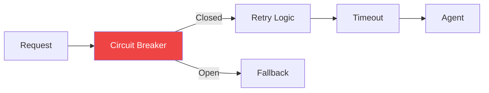

# Part 8: Production-Ready Agents

Production deployment patterns including observability, security, and containerization.

## 🏗️ Production Architecture

### Full Observability Stack



### Resilience Pattern



## 📁 Files

### Python
| File | Description |
|------|-------------|
| `python/telemetry_config.py` | OpenTelemetry setup |
| `python/content_safety.py` | Content safety filters |
| `python/resilient_agent.py` | Circuit breaker & retry |

### .NET / C#
| File | Description |
|------|-------------|
| `dotnet/TelemetryConfiguration.cs` | OpenTelemetry with OTLP |
| `dotnet/ContentSafetyFilter.cs` | PII detection & filtering |
| `dotnet/ResilientAgent.cs` | Polly-based resilience |

### Docker
| File | Description |
|------|-------------|
| `docker/Dockerfile` | Production container |
| `docker/docker-compose.yml` | Full observability stack |

## 🔑 Key Components

| Component | Python | C# |
|-----------|--------|-----|
| Telemetry | `opentelemetry-sdk` | `OpenTelemetry.Extensions.Hosting` |
| Resilience | Custom + `tenacity` | `Polly` |
| Safety Filter | `ContentSafetyFilter` class | `ContentSafetyFilter` class |

## 🚀 Running the Stack

```bash
cd docker
docker-compose up -d

# Access:
# - Agent API: http://localhost:8000
# - Jaeger UI: http://localhost:16686
# - Prometheus: http://localhost:9090
# - Grafana: http://localhost:3000
```

## 📖 Article Link

📖 [Read the full article →](https://www.dataa.dev/2025/11/19/production-ready-agents-observability-security-deployment-part-8/)
