# Part 9: MCP Integration & External Tools

Examples for connecting to MCP servers and building custom tool servers.

## 🏗️ MCP Architecture

### MCP Protocol Overview

```mermaid
flowchart LR
    subgraph Agent["🤖 AI Agent"]
        Core[Agent Core]
        MCP[MCP Client]
    end
    
    subgraph Servers["🔧 MCP Servers"]
        GitHub[GitHub]
        Slack[Slack]
        DB[Database]
        Custom[Custom]
    end
    
    Core --> MCP
    MCP <-->|Discover & Call| Servers
    
    style MCP fill:#7c3aed,color:#fff
```



### Multi-MCP Architecture

```mermaid
flowchart TB
    subgraph Agent["🤖 Enterprise Agent"]
        Core[Agent Core]
        MC1[MCP Client 1]
        MC2[MCP Client 2]
        MC3[MCP Client 3]
    end
    
    MC1 --> GitHub[GitHub MCP]
    MC2 --> Slack[Slack MCP]
    MC3 --> DB[Database MCP]
    
    style Agent fill:#0066cc,color:#fff
```



## 📁 Files

### Python
| File | Description |
|------|-------------|
| `mcp_client_demo.py` | Connect and discover tools |
| `custom_mcp_server.py` | Build custom MCP server |

### .NET / C#
| File | Description |
|------|-------------|
| `dotnet/MCPClientDemo.cs` | MCP client connection |
| `dotnet/MultiMCPServers.cs` | Multi-server integration |

## 🔑 Key Concepts

| Concept | Python | C# |
|---------|--------|-----|
| Create Client | `MCPClient(config)` | `new MCPClient(config)` |
| Connect | `await client.connect()` | `await client.ConnectAsync()` |
| List Tools | `await client.list_tools()` | `await client.ListToolsAsync()` |
| Create Agent | `mcp_clients=[client]` | `mcpClients: new[] { client }` |

## 🚀 Running the Custom Server

```bash
# Python - stdio mode
python custom_mcp_server.py

# Python - TCP mode
python custom_mcp_server.py --tcp
```

## 📖 Article Link

📖 [Read the full article →](https://www.dataa.dev/2025/11/26/mcp-integration-external-tool-connectivity-in-microsoft-agent-framework-part-9/)
