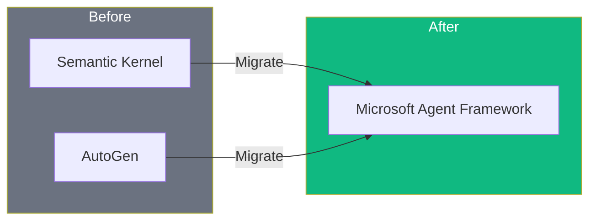

# Part 10: Migration Guide

Before/after examples for migrating from Semantic Kernel and AutoGen to Microsoft Agent Framework.

## 🔄 Migration Overview



## 📁 Files

### Python
| File | Description |
|------|-------------|
| `semantic_kernel/before_sk_agent.py` | SK agent pattern |
| `agent_framework/after_af_agent.py` | MAF equivalent |

### .NET / C#
| File | Description |
|------|-------------|
| `dotnet/MigrationDemo.cs` | Before (SK) vs After (MAF) comparison |
| `dotnet/ToolMigration.cs` | Plugin to Tool migration |

## 🔑 Key Differences

### Agent Creation

| Aspect | Semantic Kernel | Agent Framework |
|--------|-----------------|-----------------|
| Setup | `Kernel` + `AddService` | `AzureOpenAIClient.CreateAIAgent()` |
| Auth | API Keys | Azure AD / Managed Identity |
| Context | `ChatHistory` | `Thread` |

### Python Example

```python
# Before: Semantic Kernel
kernel = Kernel()
kernel.add_service(AzureChatCompletion(...))
result = await kernel.invoke_prompt("...")

# After: Agent Framework
agent = client.create_agent(name="...", instructions="...")
result = await agent.run("...")
```

### C# Example

```csharp
// Before: Semantic Kernel
var kernel = new KernelBuilder()
    .AddAzureOpenAIChatCompletion(...)
    .Build();

// After: Agent Framework
var agent = new AzureOpenAIClient(...)
    .GetOpenAIResponseClient("gpt-4o")
    .CreateAIAgent(name: "...", instructions: "...");
```

### Tool/Plugin Migration

| Aspect | Semantic Kernel | Agent Framework |
|--------|-----------------|-----------------|
| Decorator | `[KernelFunction]` | `@ai_function` (Python) |
| Attribute | `[Description]` | `[Description]` (same!) |
| Registration | `kernel.Plugins.Add(...)` | `tools: [...]` parameter |

## 📖 Article Link

📖 [Read the full article →](https://www.dataa.dev/2025/11/30/migration-guide-from-semantic-kernel-autogen-to-microsoft-agent-framework-part-10/)
